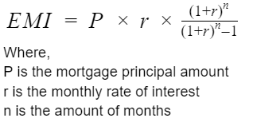

# EMIapp

### Objective
The main purpose of this assignment is to demonstrate and put into practice the knowledge learned from the lecture about best practices of mobile application development on an android platform. Creating a simple application that calculates the EMI given the user input to keep track of mortgage payments will allow us to apply the basics of mobile development. 

### Implementation
#### User Interface
The first step was to create the user interface, adding a few <TextView> for labels and <EditText> for user input. A <button> was also added at the end of the form to allow users to click once the form is completed. If the <button> gets pressed and the fields are empty a toast prompt will pop out saying “Please fill out the form correctly”. Units like the dollar signs ($), percentage (%) and years were added for a better experience by allowing the user to know what kind of input they are expected to enter.

  

#### Back-end
The entire back-end program runs in MainActivity.java, this was possible to achieve since the application is a very simple single page application. 
The first step was to retrieve the data entered from the user by using findViewbyId and creating an onClick() function to make the calculations once the button was clicked. The following formula was the one used to calculate the EMI:
  
  
  
  
Finally we are able to display the EMI and the total amount of interest using the setText() function.
  
### Challenges
During the first test of the application the system will crash right away without opening at all. The cause of this issue was that findViewById functions were being called before the onCreate() causing a null pointer error.
  
The second challenge was to prevent the user from clicking “calculate” after leaving any of the fields empty and making the application crash. This problem was fixed by adding if and else statements to check for the fields before starting to calculate the EMI.
